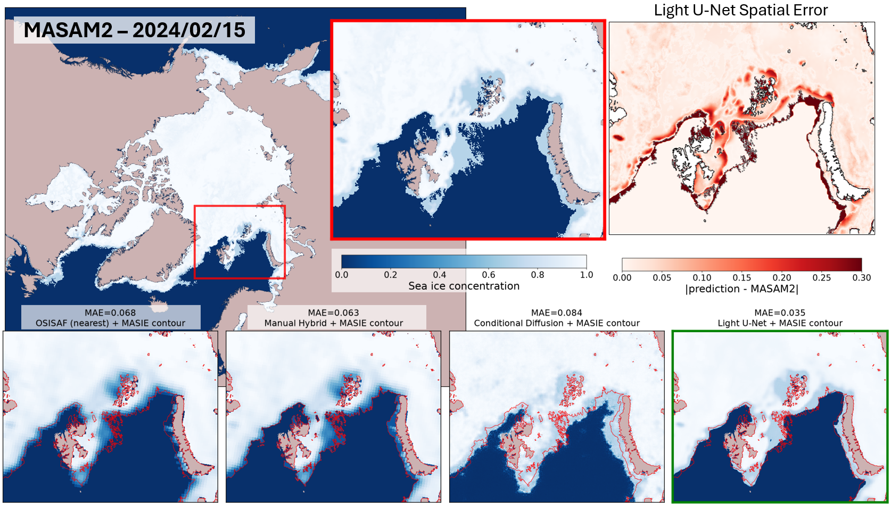
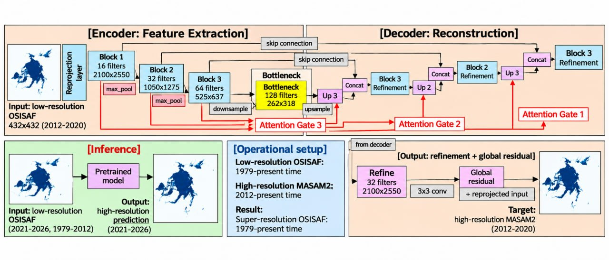
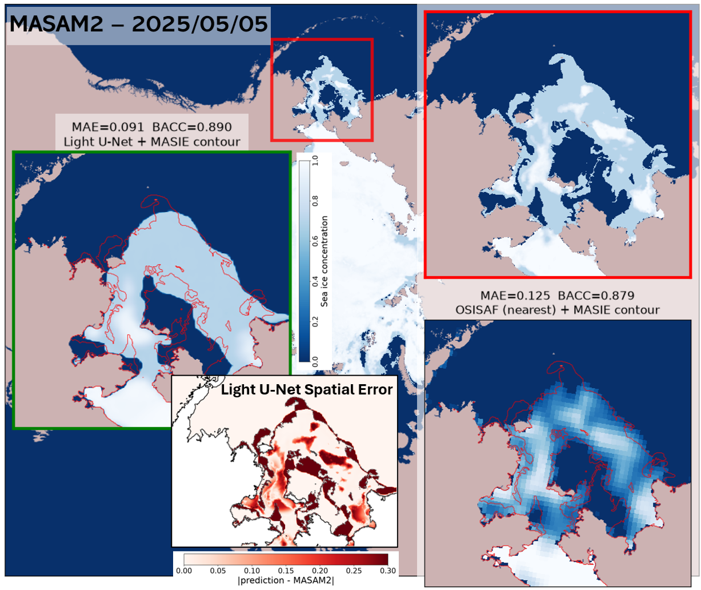

# OSISAF → MASAM2

Sea ice concentration, 25 km → 4 km. One network turns the 40-year OSISAF
climate record into MASAM2-grade fields — including the decades where MASAM2
does not exist.



*Barents Sea, 15 Feb 2024. Same day, four methods, one target. The red contour
is the MASIE ice edge; the numbers are MAE against MASAM2 on that crop.
**Light U-Net 0.035** — half the error of the manual hybrid (0.063), which needs
a separate MASIE product and ~2.8 min of remapping per field.*

---

## What makes it work

The two products do not even live on the same map: OSISAF is Lambert azimuthal
equal-area at 432×432, MASAM2 is polar stereographic at 2100×2550. That change
of projection is a **fixed, known geometric map** — nothing to learn, and no
reason to pay for it offline. [src/reprojection.py](src/reprojection.py) derives
the sampling grid analytically from the two grid definitions and applies it with
`grid_sample`, as the first layer of the network:

```
target pixel → polar stereographic → lon/lat → LAEA → source index → grid_sample
```

Zero trainable parameters, regenerated at construction, never enters the
checkpoint. Against `cdo remapnn` it agrees to **MAE 0.00122 over ocean** — for
scale, CDO's own `remapnn` and `remapbil` differ from each other by 0.0110.
The external remapping stage simply disappears from the pipeline.

The rest is a deliberately small U-Net: 7×7 kernels for a wide receptive field
at few layers, 16–128 channels, one resampling step to the target grid with the
refinement convolutions *after* it, and a global residual so the network only
ever predicts a correction to the resampled input.



Add the red gates and you get **Attention U-Net**; leave them out and you get
**Light U-Net**. Both live in [src/model.py](src/model.py) as `AttentionUNet`
and `UNetLight` over a shared `UNetBase`.

---

## Results

Test split 2023-01-01 → 2026-06-07 (~1254 days), ocean pixels only — land is
55.8% of the domain and trivially zero in MASAM2. IIEE in units of 10⁵.

| method | params | BACC ↑ | IIEE ↓ | MAE ↓ | PSNR ↑ | SSIM ↑ |
|---|---|---|---|---|---|---|
| **Light U-Net** | 2.43M | 0.973 | **0.421** | **0.020** | **20.10** | **0.966** |
| Attention U-Net | 2.44M | 0.973 | 0.439 | 0.021 | 19.96 | 0.965 |
| Conditional diffusion | 14.12M | 0.974 | 0.734 | 0.036 | 18.47 | 0.851 |
| Manual hybrid | — | 0.988 | 0.225 | 0.028 | 19.45 | 0.956 |
| Nearest + SCRIP | — | 0.965 | 0.625 | 0.032 | 18.63 | 0.948 |
| Bilinear | — | 0.787 | 2.958 | 0.125 | 10.26 | 0.907 |

Three things worth noticing:

- **Attention is redundant here.** The two U-Nets are within each other's
  standard deviation on every metric. With 7×7 kernels the encoder already has a
  wide context at every level, so the gates have nothing left to select.
- **Bigger is not the answer.** Scaling only the channel width from 0.62M to
  15.19M weights improves the ice-edge error by 7% across the whole 25× range,
  saturating near 10M. Embedding the reprojection is worth about as much — at no
  parameter cost.
- **Generative is not the answer either.** MASAM2 concentration is highly
  segmented; there is no fine-scale stochastic texture to synthesise, so the
  diffusion model's texture is only ever penalised by per-pixel metrics.

Cost: **< 1 s per field** for either U-Net, 1.4 s for diffusion (30 DDIM steps),
~2.5 min for the SCRIP baselines and ~2.8 min for the manual hybrid — which also
needs MASIE, available only from 2006, so it cannot go back in time at all.

### Polynyas survive



*Bering Sea, 5 May 2025, melt season. Open water inside the ice pack, sharp
edges, thin filaments — the structures interpolation smears into a 25 km
staircase. Light U-Net: MAE 0.091 / BACC 0.890 against 0.125 / 0.879 for
nearest-neighbour SCRIP.*

---

## Run it

```bash
pip install -r requirements.txt
export ICE_DATA_ROOT=/path/to/ice_data     # Windows: set ICE_DATA_ROOT=E:\ice
python src/paths.py                        # prints resolved paths, flags missing ones

python src/prepare_data.py                 # one-off lossless integer repack, 8x smaller
python src/train.py --task e2e --channels-last
python src/evaluate.py --task e2e --split test
```

`--task` picks the configuration, all defined in `TASKS` at the top of
[src/train.py](src/train.py):

| task | architecture | what it is |
|---|---|---|
| `e2e` | `UNetLight` | **the proposed model** — reprojection layer on the input |
| `e2e_attn` | `AttentionUNet` | same, with attention gates — the one-variable comparison |
| `e2e_head` | `UNetLight` | reprojection in the head; U-Net stays on the 432×432 grid |
| `enhance` | `UNetLight` | input reprojected offline by `cdo remapnn` instead |
| `sweep_w05 … w25` | `UNetLight` | capacity study, channel width only |

`python src/evaluate.py --task e2e --split test --baseline` scores the *input*
rather than a model — the "do nothing" reference each configuration has to beat.
`src/evaluate_baselines.py` covers the interpolation and SCRIP columns,
`src/build_manual_hybrid.py` rebuilds the manual hybrid, and `diffusion/` holds
the conditional diffusion baseline.

> **Train in fp32.** Convolutions feeding a GroupNorm are unconstrained in scale
> and drift upward during training; in fp16 they reach the 65504 ceiling in the
> *forward* pass, where no gradient scaler can help. `--channels-last` recovers
> most of the speed with none of the exposure.

Reference run: RTX 5080 16 GB, batch 1 with checkpointing and `channels_last`,
0.665 s/step at 7.9 GB peak. Training resumes from `models/unet_<task>_last.pth`
and refuses a checkpoint holding non-finite weights.

---

## Attribution

OSISAF sea ice concentration is produced by the EUMETSAT Ocean and Sea Ice
Satellite Application Facility; MASAM2 and the MASIE grid are distributed by
NSIDC. Cite the original products under their own terms — this repository
contains code only.

If you use this work, please cite:

> J. Borisova, D. Morozov, D. Gilemkhanov, N. O. Nikitin. "OSISAF-to-MASAM2:
> Deep Learning for Sea Ice Concentration Super-Resolution Product."
> AI Institute, ITMO University.


